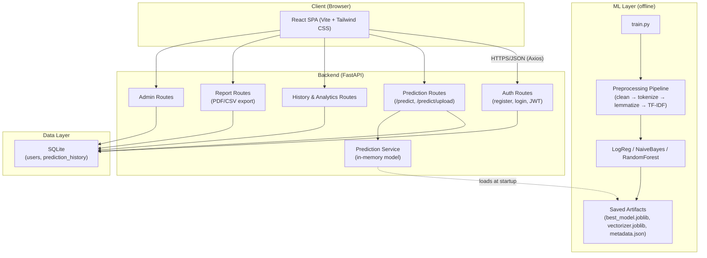
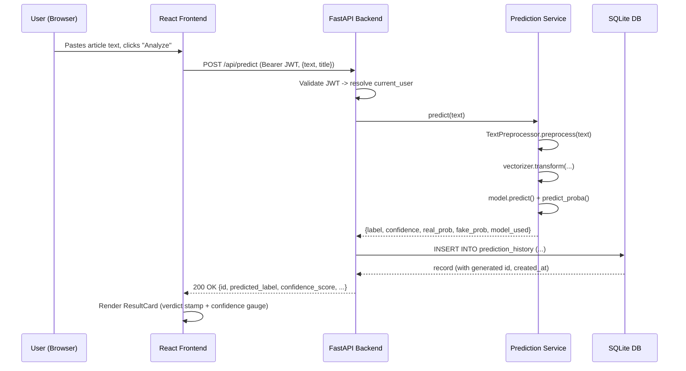
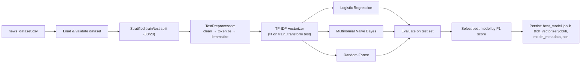
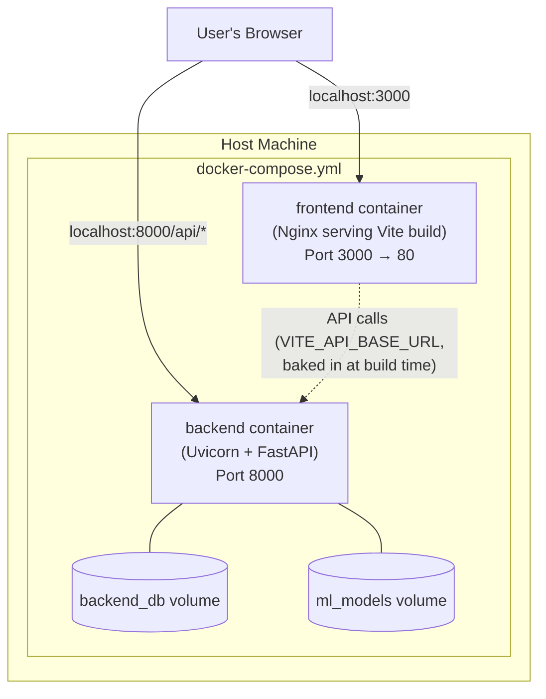

# Architecture Description

## Fake News Detection System

This document describes the system architecture in both diagram and narrative form. Diagrams use Mermaid syntax, which renders natively on GitHub and most modern Markdown viewers.

---

## 1. High-Level System Architecture

**Narrative:** The React SPA communicates exclusively over a JSON REST API with the FastAPI backend, authenticated via a JWT bearer token attached to every request after login. The backend's five route groups (auth, prediction, history/analytics, reports, admin) all read/write through SQLAlchemy to a single SQLite database. The ML layer is decoupled from the live request path: training happens offline via `train.py`, producing artifacts that the backend's `PredictionService` loads once into memory at startup and reuses for every subsequent `/api/predict` request — no retraining happens during a live request.

---

## 2. Request Flow: Submitting an Article for Classification

---

## 3. ML Training Pipeline (Offline)

---

## 4. Deployment Architecture (Docker Compose)

**Narrative:** Two containers are orchestrated by `docker-compose.yml`. The frontend container is a multi-stage build: Node builds the static Vite bundle, then Nginx serves it (with SPA fallback routing so client-side routes survive a page refresh). The backend container runs the FastAPI app under Uvicorn, with `backend_db` and `ml_models` named volumes ensuring the SQLite database and trained model artifacts persist across container rebuilds. On first boot, the backend's entrypoint script automatically generates the sample dataset and trains a model if none exists yet, so `docker compose up --build` works without any manual training step.

---

## 5. Directory-to-Layer Mapping

| Directory | Architectural Layer |
|---|---|
| `frontend/src/pages` | Presentation — route-level views |
| `frontend/src/components` | Presentation — reusable UI building blocks |
| `frontend/src/services` | Presentation — API client layer (Axios) |
| `frontend/src/hooks` | Presentation — cross-cutting state (auth, theme) |
| `backend/routes` | Application — HTTP request handling |
| `backend/services` | Application — business logic (prediction, reports) |
| `backend/auth` | Application — security (JWT, password hashing, dependencies) |
| `backend/database` | Data Access — SQLAlchemy engine/session/CRUD |
| `backend/models` | Data Access + Contract — ORM models + Pydantic schemas |
| `ml/preprocessing` | ML — shared text pipeline (training + inference) |
| `ml/training` | ML — offline training, comparison, persistence |
| `ml/data` | ML — dataset storage and generation |
